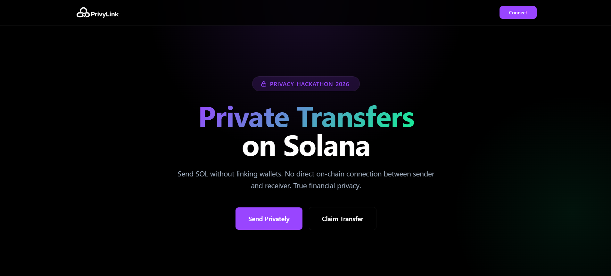
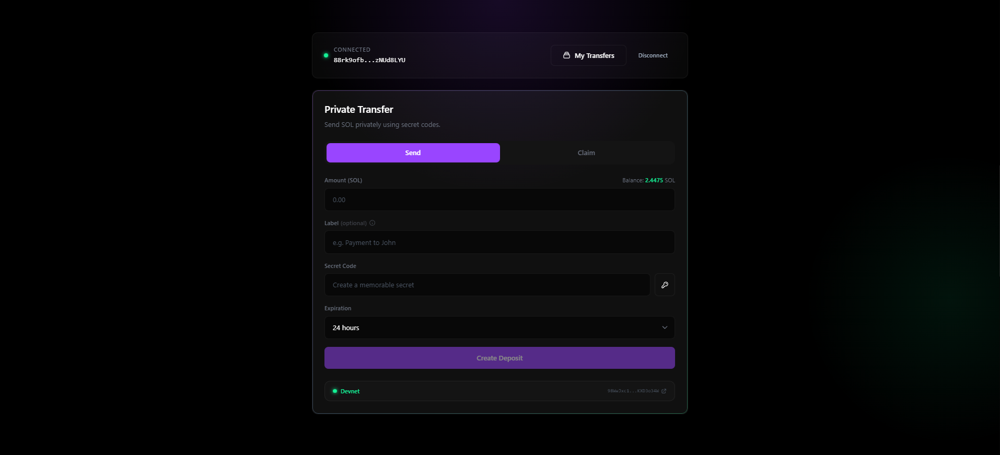
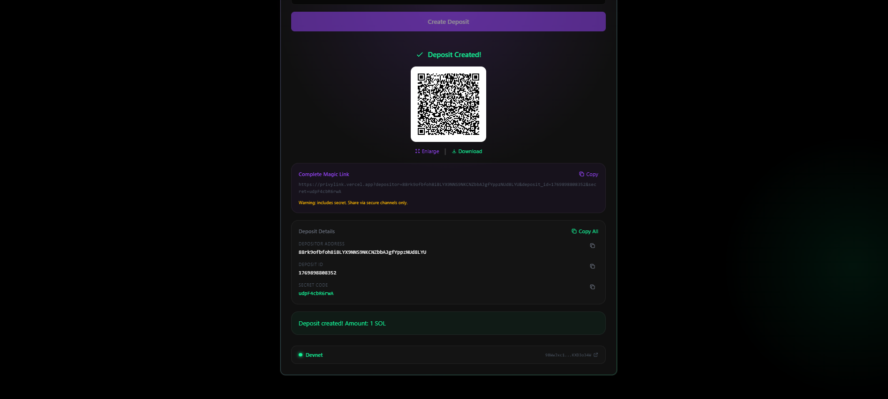
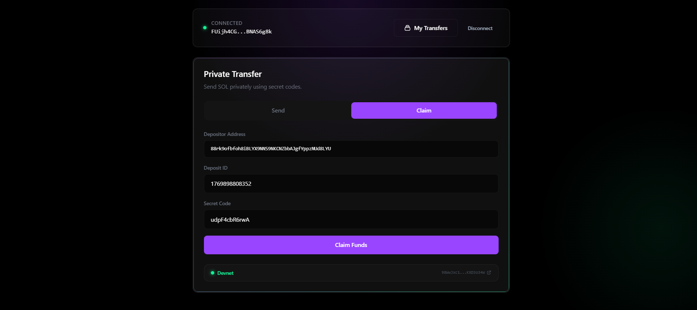
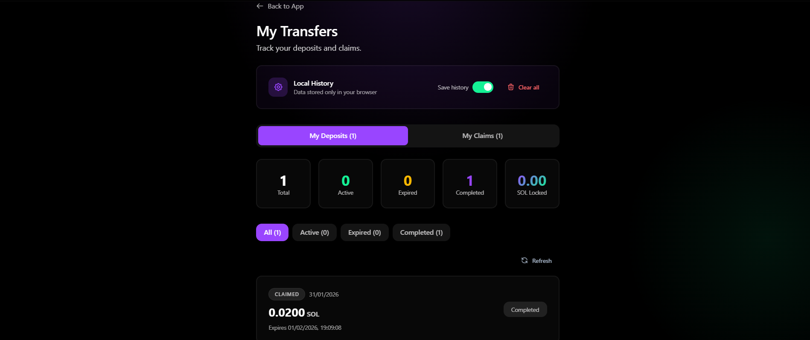
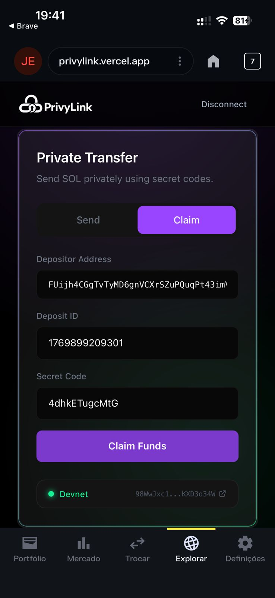
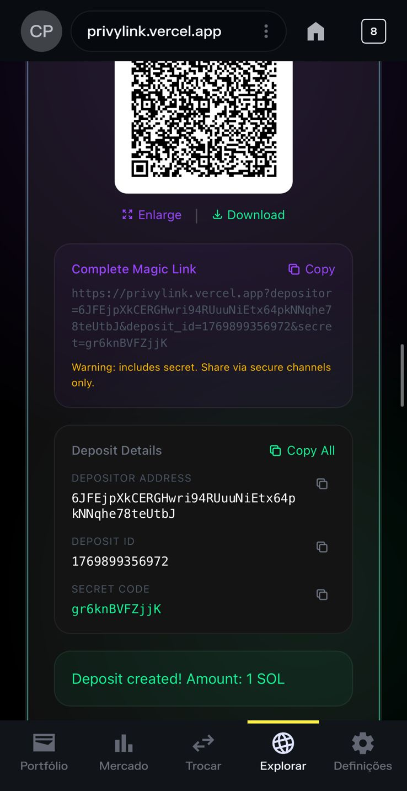

# PrivyLink

**Private SOL transfers via Magic Links on Solana**

🌐 Live Demo: https://privylink.vercel.app

📜 Program ID (Devnet): https://explorer.solana.com/address/98WwJxc1aAeqGWuaouQntJYmdQEnELntf9BqKXD3o34W?cluster=devnet

Built for **Solana Privacy Hack 2026**

---

## Overview

PrivyLink enables **private SOL transfers** without creating a direct on-chain link between sender and receiver.

Instead of sending funds wallet-to-wallet, users deposit SOL into a **temporary vault (PDA)** and share a **magic link + secret code**.
The receiver claims funds by proving knowledge of the secret — preserving **relationship privacy** on-chain.

> Not ZK. Not fully anonymous — intentionally.
> PrivyLink prioritizes **simplicity, UX, and practical privacy** over complex cryptography.

---

## The Problem

Traditional crypto transfers expose sender–receiver relationships on-chain, creating permanent public records of financial connections. This compromises financial privacy for everyday users who simply want to send funds without broadcasting their social or business relationships.

For example, sending SOL to a friend permanently exposes that relationship on-chain, even when privacy is expected.

---

## TL;DR (60 seconds)

- Send SOL → get a magic link + secret code
- Share link + secret with receiver
- Receiver claims by proving knowledge of secret
- No sender ↔ receiver link on-chain
- Manual refund available if deposit expires unclaimed

---

## How It Works

Sender ──▶ Vault PDA ──▶ Receiver

1. **Create Deposit**
   Sender deposits SOL and receives:
   - Magic Link (URL)
   - Secret Code
   - QR Code (expandable & downloadable)

2. **Share**
   Send link and secret to the receiver
   *(Tip: use different channels for extra security)*

3. **Claim**
   Receiver opens the link, enters the secret, and claims the SOL

4. **Expiration (Optional)**
   If unclaimed, sender can manually refund after expiration (1h–30d)

---

## Screenshots

### Landing Page (Desktop)

### Create Deposit (Desktop)

### Deposit Success (Desktop)

### Claim Transfer (Desktop)

### Dashboard — My Transfers

### Mobile Screenshots

<table>
  <tr>
    <td align="center">
      <strong>Claim Transfer</strong> 
      
    </td>
    <td align="center">
      <strong>Create Deposit</strong> 
      
    </td>
  </tr>
</table>

---

## Features

### Core
- Private transfers (no wallet-to-wallet link)
- Magic links (URL + QR code)
- Secret-based claims (SHA-256 hash verification)
- Configurable expiration (1h to 30 days)
- Manual refund for expired deposits
- 📱 **Mobile Deep Links:** Open claim links directly inside Phantom and Solflare wallets

### UX & Mobile
- Wallet balance display and validation
- Secret strength indicator
- QR code enlarge & download
- Local transfer history (browser only)
- Explorer links for every transaction
- Loading overlay during transactions
- Mobile deep links (Phantom & Solflare in-app browser)
- Web Share API for QR codes on mobile
- Clear error messages (wrong network, low balance, expired deposit)

### Dashboard (My Transfers)
- Deposits & Claims tabs
- Status tracking (Active / Expired / Claimed)
- SOL totals (locked & received)
- One-click refund for expired deposits

### 📚 Educational Content
- Comprehensive `/learn` page explaining on-chain surveillance
- Privacy types comparison (Relationship, Amount, Full Anonymity)
- Practical protection tips without technical jargon
- Honest comparison of privacy tools (PrivyLink, Encifher, Light Protocol)
- "Privacy for humans" approach - accessible for everyone
- Available at: [privylink.vercel.app/learn](https://privylink.vercel.app/learn)

---

## Privacy Model

PrivyLink provides **relationship privacy** using intermediary vaults:

- Sender deposits into a PDA (not receiver wallet)
- Receiver claims by proving secret knowledge
- No direct sender ↔ receiver transaction on-chain

**Private**
- Sender–receiver relationship
- Receiver identity (from sender's on-chain view)

**Public**
- Deposit amount
- Vault address
- Claim transaction

Vault PDAs are derived from depositor + unique ID.
Receiver data is **never stored on-chain**.

---

## Why PrivyLink?

| Feature | PrivyLink | ZK-based Solutions |
|------|---------|------------------|
| Setup | Simple | Complex |
| UX | Magic links + QR | Wallet-to-wallet |
| Gas | Low (single tx) | High |
| Privacy | Relationship privacy | Full anonymity |
| Time to build | Minutes | Days/weeks |

**Our approach:** hash-based verification with SHA-256.
No ZK circuits, no trusted setup, no heavy cryptography.

> *Privacy doesn't have to be complicated.*

---

## Tech Stack

- **Smart Contract:** Solana (Anchor)
- **Frontend:** Next.js + TypeScript
- **Styling:** Tailwind CSS
- **RPC:** Helius (default) / QuickNode (optional)
- **Deployment:** Vercel
- **Network:** Solana Devnet (testnet deployment)

### Why Helius?

PrivyLink uses Helius RPC to ensure reliable and fast access to Solana data, providing a stable demo experience on Devnet. The project depends on consistent RPC performance for deposit creation, claim flows, and dashboard updates. Future roadmap includes deeper integration with Helius infrastructure for real-time notifications and enhanced transaction monitoring.

**Multi-Provider Support:**
The project also supports QuickNode RPC as an alternative, demonstrating flexible infrastructure design and enabling developers to choose their preferred provider.

---

## Roadmap

### Phase 1 — MVP (Complete)
- Private deposits & secret claims
- Magic links + QR codes
- Manual refunds
- Dashboard (Deposits & Claims)
- Mobile deep links & QR sharing
- Balance checks & clear errors
- Devnet deployment

### Phase 2 — Enhanced Privacy
- Arcium MPC
- Encrypted metadata
- Stealth addresses

### Phase 3 — Production
- Mainnet
- Platform fee (0.25%)
- SPL token support
- Batch transfers

---

## Hackathon

**Solana Privacy Hack 2026**
https://solana.com/pt/privacyhack

### Competing For

🏆 **Private Payments Track** — $15,000
PrivyLink provides practical relationship privacy using PDA vaults and magic links, offering a UX-first approach to private transfers.

🏆 **Helius** — $5,000
Built on Helius RPC infrastructure for reliable devnet connectivity, enhanced error handling, and fast transaction confirmations. Future webhook integration planned for real-time notifications (Phase 2).

🏆 **QuickNode - Public Benefit Prize** — $3,000
Open-source privacy tooling with QuickNode RPC support. Flexible multi-provider architecture enables developers to choose their preferred RPC infrastructure.

🏆 **Encrypt.trade** — Privacy Education — $1,000
Educational approach to privacy: comprehensive `/learn` page explains on-chain surveillance, privacy types, and protection strategies using concrete examples instead of abstract cryptography. "Privacy for humans" philosophy - no jargon, accessible for everyone. Visit [/learn](https://privylink.vercel.app/learn) for full privacy guide.

🏆 **Open Track - Pool Prize** — $18,000
Privacy-focused application for everyday use, making private transfers accessible through familiar UX patterns (magic links + QR codes). Supported by Light Protocol.

**Total Prize Pool:** $42,000

---

## Authors

- **Renner Oliveira**

  GitHub: https://github.com/renner16
  
  X: https://x.com/_renner_araujo

- **Geovana Marques**

---

## License

MIT License — see `LICENSE` file for details.

> Privacy is not a luxury. It's a fundamental right.
